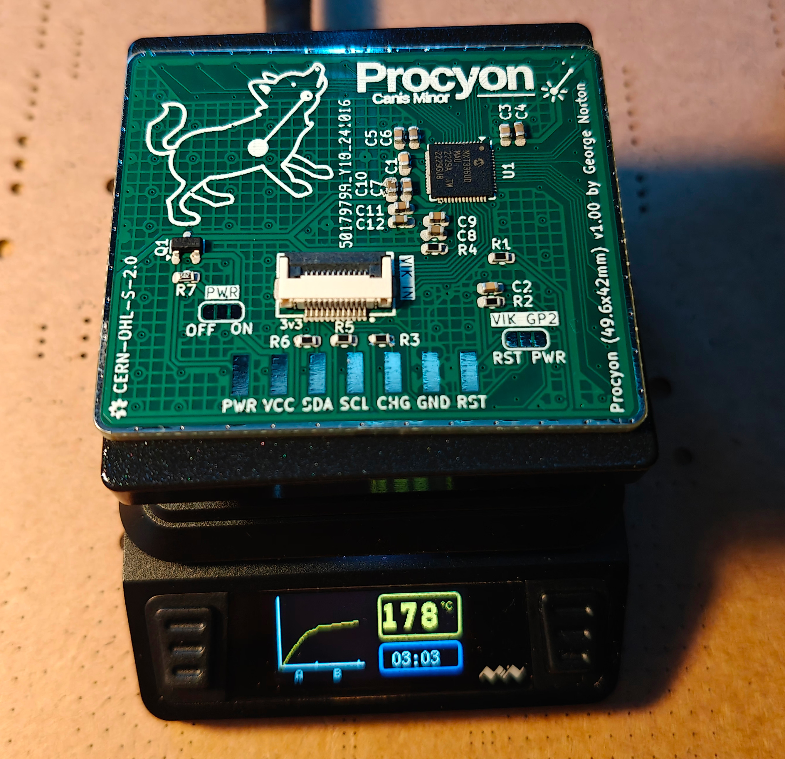
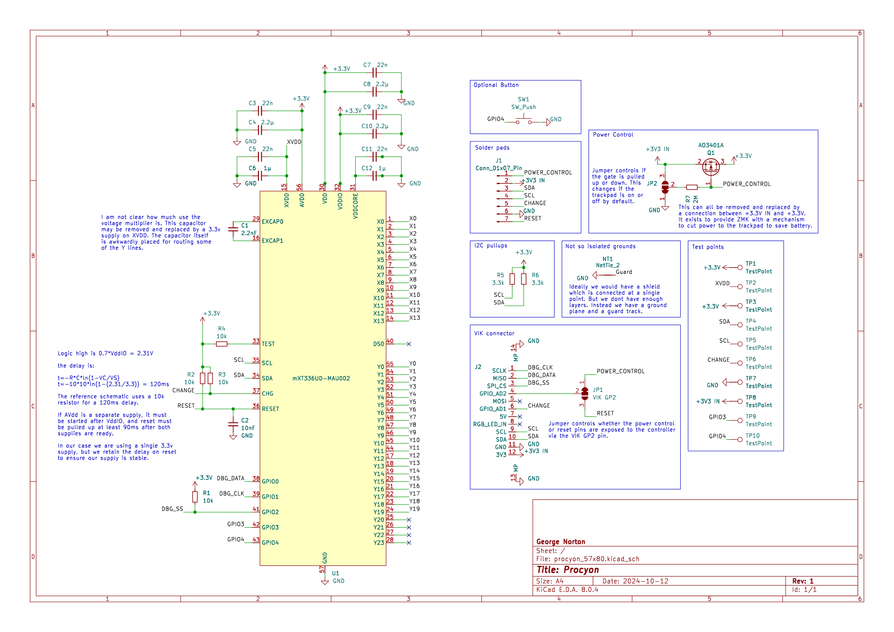

# Procyon

Procyon is an experimental trackpad similar to, but different from [Peacock](https://github.com/george-norton/peacock).
The PCBs themselves are small and I intend to add more sizes over time. Unlike Peacock, these are not standalone devices, they are intended to be
built into QMK/ZMK keyboards.

## Differences from Peacock

- Removed the separate LDO for AVCC - it all runs of the VIK 3.3v line which is preferable for wireless builds.
- Added a MOSFET to allow cutting power to the module, again this is a power saving feature for ZMK.
- The PCB is 4-layers with all the components mounted on the reverse of the sensor.
- Far smaller sensor areas.
- No integrated controller - these are meant for integrating into your own builds.

## Naming

Like Peacock, Procyon is named after a navigational star.

## Assembly

Procyon can be assembled by JLCPCB, or your favorite factory. Alternatively, if you feel brave, the components are not
too tiny (0603) so it can be assembled on a small hotplate (such as the MHP50), you will probably need a stencil, and
paste suitable for narrow apertures. The component placement (other than the optional button) is common between boards, so the same stencil can be reused.

The 57x80 variant has an optional footprint for a button. This button is wired to a GPIO on the MaxTouch IC and is accessable
through the MaxTouch GPIO interface.

## Surfaces

A surface is required for the sensor to function. This should be an insulator, it should also feel nice since you will be touching it a lot. It is a good idea to fix the sensor to the board with glue or double sided tape. Good surface materials include:
- Vinyl
- PLA (printed at 0.5-1.6mm thickness - 100% infil)
- Acrylic (will need tuning tweaks if its thick)

## Wiring it up

- The easiest way to wire up a Procyon is via the [VIK](https://github.com/sadekbaroudi/vik) interface. Usually this requires a 12P 0.5mm pitch type A FFC cable. But For the Dilemma and SplitKB Halycon boards, you will need a type B cable instead.
- Alternatively you can solder wires to the pads on the board. You will need a minimum of VCC (3.3v), GND, SDA, SCL and CHG (connect to any GPIO pin).

## Schematic

